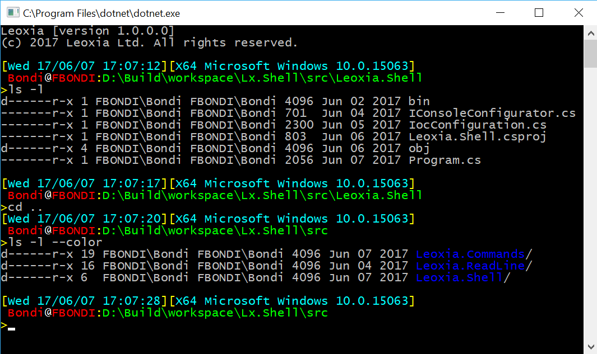

# Leoxia.Shell
Bash/Cmd clone for Windows. Written in .NET Core.
Not tested on Linux but should work as well.

## Navigation on command Line

- Use Ctrl+A, Home, Ctrl+E, End, Left Arrow, Right Arrow to navigate
- Ctrl+K, Backspace to delete characters.

## History

- Can access history of commands with up arrow, down arrow, Ctrl+P, Ctrl+N.
- Can modify current command or history without losing current command.

## Run executables in $PATH / %PATH%

- Search in path for the exe (add .exe on Windows).

## Capture Standard Output / Standard error

- Standard output/error is captured from child process and displayed in console.

## Environment Variables Expansion

Expand `${VARIABLE}` `$VARIABLE` `%VARIABLE%`

## Builtins

The following builtins are already implemented

- echo
- cd 
- mkdir
- ls (options -l, -a, --color)
- exit

## TODO

- History save between runs
- History search 
- Completion
- Alias management
- Standard Input redirection
- Redirection operators < | > 
- Prompt customization
